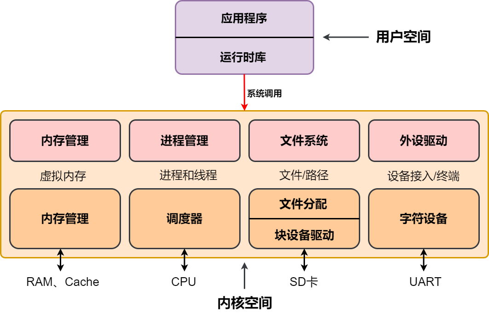

# 全国大学生系统能力大赛内核实现赛道文档

## 基本情况

我们内核名称为 Too Low Too Simple Kernel，该内核是参考了 MOS、xv6 思路的基础上，重新设计的一个宏内核。该内核支持内存管理、进程和线程管理、中断和异常、Fat32 文件系统、Shell 界面，在决赛第一阶段期间增加了对动态链接、信号和信号量的支持。

## 整体架构

整体架构如下图所示：



## 相关技术文档

我们的内核有许多组成部分，各部分的设计思路详见下面的文档：

### 初赛阶段

* [内存管理](memory.md)
* [进程管理和线程管理](process.md)
* [异常和系统调用](trap.md)
* [SD 卡驱动](sd.md)
* [UART 驱动](uart.md)
* [文件系统介绍](fat-design.md)
* [文件系统实现](fat-impl.md)
* [文件系统相关系统调用](fat-syscall.md)
* [多核启动](multicore.md)
* [睡眠锁](sleeplock.md)
* [用户程序和 Shell](shell.md)
* [测试程序](test.md)

### 决赛第一阶段

* [动态链接](dynamic.md)
* [信号量](futex.md)
* [信号](signal.md)

## 各阶段分工

### 初赛阶段

陈纪源：SD 卡驱动、多核启动、虚拟文件系统

郭衍培：系统初始架构、虚拟文件系统

邹增禹：FAT32 文件系统、Shell 移植

### 决赛第一阶段

陈纪源：Futex、内核级线程、信号

郭衍培：Socket、信号

邹增禹：动态链接

## 遇到的问题及解决方法

### Sifive Unmatched 开发板 SD 卡驱动问题

四月中旬我们开始开发 Sifive Unmatched 的 SD 卡驱动，当时在 github 上找了一下是否有开源驱动，但是并没有找到一个完整的驱动，（仅有一个启动时的读 SD 卡驱动，没有写驱动）。最终我们决定在这个不完整的驱动上自主开发一个完整的读写驱动，通过搜集资料我们找到了 SPI 总线协议，按照时序图编写了比较简单的单块读的 `CMD17` 命令和单块写的 `CMD23` 命令。在 QEMU 上通过测试后，又在开发板上进行了测试，结果发现驱动非常不稳定，经常出现无法正常读写的情况。并且在评测的开发板上并不支持 `CMD23` 命令，因此我们又编写了多块读写的 `CMD24` 命令。为了解决驱动不稳定问题，我们给驱动增加了超时重读机制，如下所示：

```c
    if (!timeout) {
        goto retry;
    }
    ......
retry:
    writeTimes++;
    if (writeTimes > 10) {
	    panic("[SD Write]There must be some error in sd write");
    }
    sd_cmd_end();
    goto start;
```

当出现读写超时时，会跳转到 `retry` 标签，SPI 协议重新初始化，并跳转到 `start` 标签重新进行读写操作。同时我们设置了超时重读的阈值次数，当超过 10 次后就认为 SD 卡外设有严重问题，需要进行检查。这一方法有效增加了 SD 卡驱动的鲁棒性，提高了驱动的稳定性。在决赛第一阶段的评测时，我们也发现这一方法有效降低了因为驱动而出错的概率。

### QEMU 上通过文件系统测试后开发板上有误

五月上旬我们在 QEMU 上通过了 `ls` 指令输出开发板上文件的内容，但是在开发板上只能显示 `.` 和 `..`，相当于并没有正确读出 SD 卡中内容。后来发现是 QEMU 上实现的 SPI 协议有问题的，具体来说在进行磁盘块的读写前需要指定读写的块号，在 QEMU 上则要求传字节数，这个实现的差异导致同一份代码在两边的结果并不一样，因此最终我们将代码改为：

```c
    #ifdef QEMU
    if (sd_cmd(24 | 0x40, now * 512, 0) != 0) {
    #else
    if (sd_cmd(24 | 0x40, now, 0) != 0) {
    #endif			
```

通过 `QEMU` 这一个宏来区分两个的差异，可以减少切换测试平台代码的修改。

### 开发板上 EXEC 加载数据不正常

五月中旬开始测试系统调用的测试点，在 QEMU 上实现非常正常，但是在开发板上测试发现加载结果并不正确。通过打印出页表发现加载的数据并没有错误，TLB 在刷新页表时也已经清空。因此猜测可能和 Cache 相关。考虑到 `exec` 加载的是指令数据，而 Sifive unmatched 开发板的 Cache 有指令和数据 Cache 两种，因此我们选择在每次刷新数据时，执行下面的指令：

```c
    asm volatile("fence.i");
```

清空指令 Cache，成功解决这一问题。

### Pthread 线程问题

7月20号我们开始测试 `pthread` 相关的测试点，结果发现很多测试点行为并不正确。当时我们尝试通过使用进程模拟线程，但是遇到了很多问题：`ofile` 数组文件对于线程是公用的，而进程则是拷贝的；线程的页表是同一个，而进程则是同一个。进程和线程处理的太大差异让我们决定实现内核级线程，即在内核中以线程为最小调度单位，而进程则是一种资源的管理单元。进程控制块和线程控制块如下图所示：

```c
typedef struct Process {
    struct ProcessTime processTime; // 记录进程上一次运行的时间，用于计算 CPU 时间
    CpuTimes cpuTime; // 记录进程在用户态或内核态运行的 CPU 时间
    LIST_ENTRY(Process) link; // 空闲进程控制块链表指针
    u64 *pgdir; // 进程页表
    u32 processId; // 本进程编号
    u32 parentId; // 父进程编号
    u32 priority; // 进程优先级
    enum ProcessState state; //进程状态
    struct Spinlock lock; // 访问进程控制块的互斥锁
    struct File *ofile[NOFILE]; // 打开文件列表
    u32 retValue; // 进程返回值
    u64 heapBottom; // 进程的堆顶部地址
    struct dirent *cwd; // 进程当前工作目录
    int threadCount; // 进程包含的线程数量
    struct ResourceLimit fileDescription; // 文件描述符数量最大限制
} Process;
```

```c
typedef struct Thread {
    Trapframe trapframe; // 每个线程对应的 Trapframe，保存中断或异常时的寄存器信息
    LIST_ENTRY(Thread) link; // 空闲线程控制块链表指针 
    u64 awakeTime; // 线程下一次可以被调度的时间
    u32 id; // 线程编号
    LIST_ENTRY(Thread) scheduleLink; // 线程调度队列链表 
    enum ProcessState state; // 线程状态
    struct Spinlock lock; // 访问线程控制块互斥锁
    u64 chan; // 等待资源
    u64 currentKernelSp; // 内核栈指针
    int reason; // 调度原因
    u32 retValue; // 线程返回值
    SignalSet blocked; // 线程信号掩码
    SignalSet pending; // 线程信号状态
    SignalSet processing; // 线程处理信号状态
    u64 setChildTid; // 设置 tid 地址标识
    u64 clearChildTid; // 清空 tid 地址标识
    struct Process* process; // 线程对应进程控制块指针
    u64 robustHeadPointer; // robust 锁地址
    struct SignalContextList waitingSignal; // 需要处理的信号链表
} Thread;
```

通过这种各自管理的方式，权责分明，有效解决之前所说的两个问题。

### 静态加载行为有误

7月24日在调 `pthread_create` 函数时，查阅源代码后发现线程在 `SYS_mmap` 系统调用时传入的 `size` 大小为 0，而正常情况下申请的栈空间无论如何也不应该是 0，经过仔细排查确定 `libc.PAGE_SIZE` 这一个变量是 0，查找这一变量的赋值发现该变量是通过辅助数组 `aux` 赋值的，而我们当时认为静态链接只需要传 `argc`、`argv` 和 `envp`数组。因此我们按照动态链接的方式同样传了 `aux` 数组，成功解决这一问题。

### 信号重入问题

7月28日，我们尝试实现一个比较完整的信号机制，因为有两个测试点是需要异步取消线程的。当时在讨论线程的信号是否可以重入时，用 Linux 尝试了一下，发现信号确实是可以重入的。这个对于架构的要求就更难了一点，因为要保证重入的代码结束之后能回到原来的上下文状态。因此我们设计了一个 Signal 的链表，如下所示：

```c
typedef struct SignalContext {
    Trapframe contextRecover; // 处理信号之前的上下文
    bool start; // 信号是否开始处理
    u8 signal; // 信号类型
    ucontext* uContext; // 用户态上下文物理地址
    LIST_ENTRY(SignalContext) link; // 链表
} SignalContext;
```

当开始处理上下文时，将当时的上下文 `Trapframe` 拷贝到 SignalContext 中的上下文，当处理完结束再拷贝回去。当在处理信号中间由触发新的信号时，回将一个信号插入线程的列表首部，重新处理前面的信号，这样就可以解决重入的问题了。

支持完信号重入问题后，我们发现 `pthread_cancel_points` 测试点出现了死循环的问题，原因是同步取消在线程的取消掩码关闭之前会重新给自己发送一个 `SIGCANCEL` 信号，这点就导致回到内核态之后会重新处理这个新的信号导致死循环。为了解决这一问题，我们在 Linux 上进行了一下测试，发现同类型的信号是不能重入的，更进一步来说，如果当前内核在处理一个线程的某一个信号，如果收到一个同类型的信号，则并不会立即处理这一个信号。因此我们仿照这一个设计，在线程控制块中增加了 `processing` 表示正在处理的信号类型位图，解决了这一个问题。

## 比赛收获

* 通过操作系统大赛，我们学习到了最先进的 Linux 对问题的解决思路，并在此基础上提出了我们对于这些问题的解决思路。

* 为我们之后在系统领域深造打下了深厚的基础

## 致谢

* 感谢北航的沃天宇老师给予我们一定的指导思路