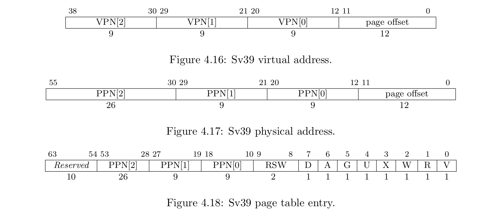
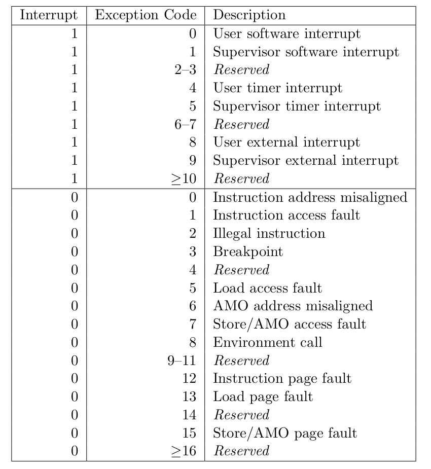
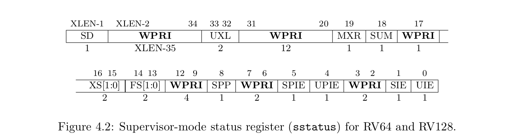
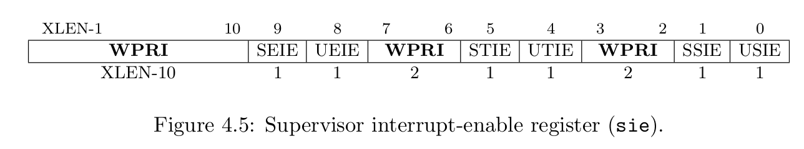

# RISCV64 之旅

## QEMU 
安装5.0.0的版本

首先下载

```shell
wget https://download.qemu.org/qemu-5.0.0.tar.xz
```

解压缩

```shell
tar xvJf qemu-5.0.0.tar.xz
```

进入该目录，并进行配置

```shell
cd qemu-5.0.0
./configure
```

进入该目录，并进行配置

```shell
sudo make
sudo make install
```

## RISC-V

### 一些 features

启动必然在 M 级

Trap 包括垂直 Trap (异常级上升)和水平 Trap (异常级不变)

物理地址空间56位（板子是56根线 不代表内存地址空间是$2^{56}$），虚拟地址空间64位

XLEN 是长度不固定，因为 RISC-V 有32, 64, 128三种长度的类型。（我们使用64）


### 寄存器列表

| 寄存器编号   | 编程接口名 | 补充说明                        |
|---------|-------|-----------------------------|
| x0      | zero  | -----                       |
| x1      | ra    | -----                       |
| x2      | sp    | -----                       |
| x3      | gp    | -----                       |
| x4      | tp    | Thread pointer              |
| x5-7    | t0-t2 | -----                       |
| x8      | s0/fp | -----                       |
| x9      | s1    | -----                       |
| x10-x11 | a0-1  | Parameter(2) & Return Value |
| x12-x17 | a2-7  | Parameter(8)                |
| x18-x27 | s2-11 | -----                       |
| x28-x31 | t3-6  | -----                       |

### 和MIPS指令差异

无符号: addu -> addw

存储指令: ld(64) sw(32) sd(64)

### 内嵌汇编

这块在之前移植开发时基本没有使用，因此需要学习。

#### 基本内联汇编

asm("statements")

插入多条汇编: asm("li x17, 81\n\t"
                "ecall")

volatile: 阻止编译器进行优化

#### 扩展内联汇编

asm volatile(

"statements"（汇编语句模板）:

output_regs（输出部分）:

input_regs（输入部分）:

clobbered_regs（破坏描述部分）

)

#### 在C语言中输出某个寄存器

```c
int x;
asm volatile(
    "sd s5, %0"
    :"=m"(x)
    :
    : "memory")
printf("x=%d\n", x)
```

将寄存器 s5 中的值输出到变量 x 中

#### 操作控制寄存器

写控制寄存器: csrw satp xxx (asm volatile("csrw satp, %0" : : "r" (x));)

读控制寄存器: csrr xxx satp (asm volatile("csrr %0, satp" : "=r" (x)) );

### 机器特权态

#### 三种模式

最高级: 机器模式(M)

次高级: 监管者模式(S)

最低级: 用户模式(U)

#### CSRs

全称 Control and Status Registers

在不同模式下有不同的 CSRs

##### Machine(CSRs)

| 寄存器      | 作用    |
|----------|-------|
| mscratch | M栈顶指针 |

### 内存管理

#### 页表结构

结构是三级页表，如下图所示

SATP 寄存器用来保存 PDT 在内存中的物理地址

填写 SATP 寄存器需要调用宏 MAKE_SATP (页表的物理地址)

该宏会将 SV39 这个信息填入

之后需要调用 sfence_vma() 去同步修改



​	权限位有必要讨论一下，如下表所示

| 位置  | 权限位  | 作用     |
|-----|------|--------|
| 0   | V    | 是否有效   |
| 1   | R    | 是否可读   |
| 2   | W    | 是否可写   |
| 3   | X    | 是否可执行  |
| 4   | U    | 是否为用户态 |
| 5   | G    | *全局位   |
| 6   | A    | 以获取位   |
| 7   | D    | 脏位     |

如果 PTE 都是0，则是中间页表项；如果 PTE 有一个不为0则是最后一级页表项

RSW 是保留位

#### TLB

清空 TLB 指令 sfence_vma

### 异常处理

#### 现场保护


#### TrapFrame


#### STVEC 寄存器

异常向量地址寄存器

高 XLEN-2 位是 BASE 地址，4字节对齐

后两位选择直接或者向量模式 MODE

0 表示 直接模式（相当于异常向量地址是相同的 BASE ）

1 表示 向量模式（根据异常类型进行分发到BASE + 4 $\times$ Cause）

总共24种异常类型，如下图所示



如果采用向量方式的话，每个会跳到不同的位置（但是只有一条语句，不像ARM里面有16条语句）

#### SEPC寄存器

S 级 EPC 寄存器，保存异常的 PC 值

#### SSCRATCH寄存器

S 级可以用来保存 U 级寄存器的值

和 MIPS 体系结构中的 k0 和 k1 寄存器不同

该寄存器使用在内核态，这样可以增加用户态寄存器数量

在 xv6 中，异常向量入口是 kernelvec（在文件kernelvec.S中）。

#### SSTATUS寄存器

记录当前处理器的状态的寄存器，这个在开启中断\异常时比较关键



SIE 位是内核中断是否开启，开启后将开始响应中断

#### SIE寄存器

S 级中断使能寄存器



这里分成三组，每组都是由 U 和 S 组成的(其中 U 表示用户态，S 表示内核态)

EIE 表示外部中断

TIE 表示时钟中断

SIE 表示软件中断

在我们的 OS 中需要去支持内核级的三个中断模式

## RUSTSBI 的理解

感觉就是一个抽象的平台（类似与QEMU之上的硬件模拟器）

因为 K210 的 ISA 是 RISC-V 特权级 v1.9.1

而当前的硬件模拟器是 RISC-V v1.10，版本完全不同（有相当多的寄存器是不一样的）

这块应该在上板子之后需要考虑的内容